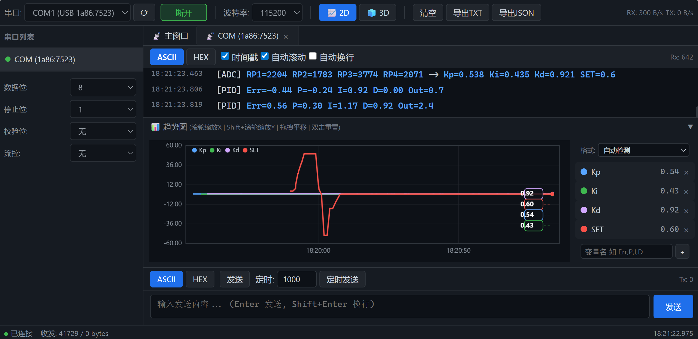
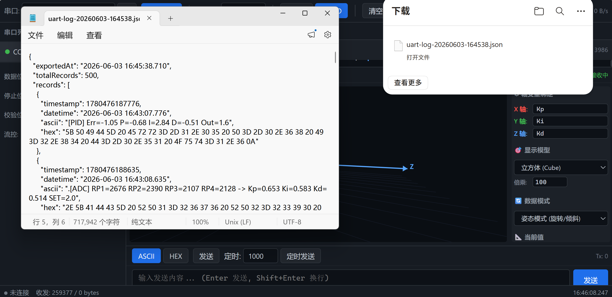

# UART 串口调试助手

纯浏览器端串口调试工具，单文件 HTML，无需安装，双击即用。

支持 **2D 实时趋势图** + **3D 空间可视化**，专为嵌入式开发调试设计。

---

### 📺 演示视频

▶️ **[点击观看 2D 趋势图演示](screenshots/2D演示视频.mp4)**

---

## 环境要求

| 项目 | 说明 |
|------|------|
| 浏览器 | **Chrome** 或 **Edge**（需要 Chromium 内核，支持 Web Serial API） |
| 操作系统 | Windows / macOS / Linux 均可 |
| USB 转串口驱动 | **Windows 需安装**（CH340/CP2102/FT232 等），macOS/Linux 免驱 |
| 额外依赖 | **无**。不需要 Node.js、不需要 npm install、不需要任何 JS 库或 CDN |
| 网络要求 | **不需要**。完全离线可用，下载后双击即可 |

> [!IMPORTANT]
> **Windows 用户首次使用前，需先安装 USB 转串口驱动（如 CH340）。详见下方「步骤 0」。**

---

## 功能

### 串口通信
- Web Serial API，Chrome / Edge 浏览器原生支持
- 波特率、数据位、停止位、校验位、流控 全参数可配
- 热插拔自动检测，多串口同时连接

### 数据收发
- 接收区 ASCII / HEX 双模式切换，毫秒级时间戳
- 发送区 ASCII / HEX 输入，支持手动发送 + 定时发送 + 发送历史
- 自动滚动 / 暂停 / 自动换行

### 变量解析 & 趋势图
- 支持 6 种常用嵌入式数据格式，自动检测或手动切换
- 自定义变量绑定，实时多线折线图（暗黑主题）
- 滚轮缩放、拖拽平移、双击重置

### 三维空间调试
- 2D / 3D 一键切换
- 姿态模式（旋转角度）与位置模式（空间坐标）
- 立方体、电路板、坐标点、轨迹线四种模型
- 变量自由绑定到 X/Y/Z 轴，支持倍乘

### 数据导出
- TXT 日志（含 HEX dump）/ JSON 结构化数据



---

## 快速开始

### 0. 前提：安装串口驱动（仅 Windows 需要）

如果你的 USB 转串口芯片是 **CH340 / CH341**（最常见的国产芯片），Windows 默认没有驱动，必须先安装。

1. 打开设备管理器（Win+X → 设备管理器）
2. 插上 USB 转串口设备
3. 如果看到「端口 (COM 和 LPT)」下有 `USB-SERIAL CH340 (COMx)`，说明驱动已装好，跳过此步
4. 如果看到「其他设备」下有黄色叹号 `USB2.0-Serial`，说明没装驱动

**下载 CH340 驱动**：[WCH 官网](http://www.wch.cn/downloads/CH341SER_EXE.html) 下载对应系统版本，安装后重新插拔设备。

> 常见 USB 转串口芯片驱动情况：
>
> | 芯片 | Windows | macOS | Linux |
> |------|:-------:|:-----:|:-----:|
> | CH340/CH341 | **需安装** | 免驱 | 免驱 |
> | CP2102 | 需安装 | 免驱 | 免驱 |
> | FT232 | 需安装 | 免驱 | 免驱 |
>
> **macOS / Linux 用户一般插上就能用。**

### 1. 打开
用 Chrome 或 Edge 浏览器打开 `serial-monitor.html`（双击即可）。

> 必须使用 Chromium 内核浏览器，Firefox / Safari 不支持 Web Serial API。

### 2. 连接串口
1. 顶部工具栏选择串口设备
2. 配置波特率等参数（默认 115200-8-N-1）
3. 点击「**连接**」


### 3. 收发数据
- 接收区实时显示数据，支持 ASCII / HEX 切换
- 底部输入框发送数据，按 `Enter` 发送，`Shift+Enter` 换行

### 4. 趋势图
1. 右侧面板选择数据格式（或保持自动检测），输入要追踪的变量名
2. 数据中出现匹配变量时自动绘制折线
3. 滚轮缩放、拖拽平移、双击重置

**支持的数据格式：**

| 格式 | 示例 | 典型设备 |
|------|------|----------|
| `key=value` | `Err=-0.53 P=0.34` | STM32 / PID调试 / 通用串口 |
| `key:value` | `H:15 T:12` | 传感器模块 / GPS |
| `{key:value}` | `{H:15, T:12}` | 自定义协议 |
| **JSON** | `{"temp":25.5}` | ESP32 / MQTT / IoT |
| **CSV** | `15,12,0.53,2972` | 数据采集器（需配置列名） |
| **AT指令** | `+CWLAP:(3,-45)` | ESP8266 / 4G模块 |

默认「自动检测」会同时尝试所有格式，选匹配最多的使用。

### 5. 三维空间
1. 点击工具栏 `🧊 3D` 切换到三维视图
2. 绑定变量到 X / Y / Z 轴
3. 选择数据模式（姿态/位置）和模型类型
4. 鼠标拖拽旋转、滚轮缩放


### 6. 导出数据
点击工具栏「导出TXT」或「导出JSON」，自动下载带时间戳的日志文件。



---

## 快捷键

| 快捷键 | 功能 |
|--------|------|
| `Enter` | 发送数据 |
| `Ctrl + Shift + C` | 连接 / 断开 |
| `Ctrl + L` | 清空接收区 |

---

## 技术栈

纯浏览器原生技术，零 npm、零框架、零 CDN：

| 层 | 技术 |
|----|------|
| 结构 | HTML5 |
| 样式 | CSS3 |
| 逻辑 | 原生 JavaScript (ES6+) |
| 图表 | Canvas 2D 自绘 |
| 3D | Canvas 2D 软件渲染 |
| 串口 | Web Serial API |

---

## 🤖 AI Agent 自动化闭环配置

配置一次后，AI Agent 可以**自主读取串口数据、分析问题、修改参数**，无需你手动导出文件。

### 适用 Agent

| Agent | 方式 |
|-------|------|
| Claude Code（VSCode 扩展） | CDP 直连 |
| Cursor / Copilot | 通过 DevTools Console 读取 |
| 任意 AI 工具 | 页面内置 `#ai-data-store` 数据接口 |

---

### Claude Code 自动化配置（CDP 直连）

AI 直接连到你浏览器的调试端口，实时读取 DOM 上的串口数据。

#### 1. 完全关闭 Edge

PowerShell 执行（必须，否则调试端口不生效）：

```powershell
taskkill /f /im msedge.exe
```

> 确保任务管理器中没有残留 `msedge.exe` 进程。

#### 2. 带调试端口启动 Edge

Win+R 打开运行框，输入：

```
msedge --remote-debugging-port=9222
```

回车启动 Edge。

> 一劳永逸：右键 Edge 桌面快捷方式 → 属性 → 目标后面加 ` --remote-debugging-port=9222`，以后双击图标就是调试模式。

#### 3. 打开串口助手并连接设备

在刚才启动的 Edge 浏览器地址栏输入你的 `serial-monitor.html` 文件路径。每个人存放位置不同，按你的实际路径修改：

```
file:///C:/work_app/UART/serial-monitor.html
```

> 路径格式：`file:///` + 你的文件夹路径 + `/serial-monitor.html`
>
> 例如：`file:///D:/projects/serial-monitor.html` 或 `file:///C:/Users/你的用户名/Desktop/serial-monitor.html`
>
> **提示**：在文件资源管理器中找到 `serial-monitor.html`，按住 Shift 右键 → 「复制文件路径」，粘贴到地址栏后在最前面加上 `file:///`。

回车打开页面后，选择串口设备，点击「**连接**」，确认接收区有数据刷新。

#### 4. 回到 AI Agent 对话

在 Claude Code 中发送指令即可，例如：

> "读取串口助手最近 30 条数据，帮我分析 PID 参数是否合理"

AI 会自动通过 CDP 连接浏览器、执行 JS 读取页面数据、返回分析结论。

#### 工作流程

```
taskkill 关 Edge → 调试端口启动 → 打开串口助手连设备 → 回对话让 AI 分析
                                                              ↓
                                         AI 读数据 → 分析 → 建议/改代码 → push
```

---

### 手动分析方式（两种）

如果暂时不想配置 CDP 自动化，也可以通过以下方式把数据交给 AI 分析。

**方式 A：导出 JSON 按钮**

1. 在串口助手页面顶部工具栏，点击「**导出JSON**」按钮
2. 浏览器会自动下载一个 `uart-log-xxxxxx.json` 文件
3. 在 AI 对话中直接拖入该文件，或说：

> "读取 C:/Users/xxx/Downloads/uart-log-xxxxxx.json，帮我分析 PID 参数"

**方式 B：Console 一键复制**

1. 在串口助手页面按 **F12** 打开开发者工具
2. 切换到 **Console** 标签
3. 粘贴以下代码，回车执行：

```javascript
// 复制最近 30 条数据到剪贴板，直接贴给 AI
copy(JSON.stringify(
  Array.from(document.querySelectorAll('.receive-line[data-ascii]'))
    .slice(-30)
    .map(l => ({ time: new Date(+l.dataset.timestamp).toLocaleTimeString(), data: l.dataset.ascii })),
  null, 2
))
```

4. 看到 Console 输出 `undefined` 说明已复制成功，直接 **Ctrl+V** 粘贴给 AI 即可。

> 修改 `.slice(-30)` 中的数字可以调整复制的行数，例如 `.slice(-100)` 取最近 100 条。

---

### 页面数据接口速查

| 目标数据 | 查询方式 |
|----------|----------|
| 最新 N 条接收数据 | `document.querySelectorAll('.receive-line[data-ascii]')` |
| 单条时间戳 | `el.dataset.timestamp` |
| 单条 ASCII | `el.dataset.ascii` |
| 单条 HEX | `el.dataset.hex` |
| 串口连接状态 | `document.querySelector('[data-port-status]').dataset.portStatus` |
| 完整数据存储 | `document.querySelector('#ai-data-store')` |

---

## 文件结构

```
├── serial-monitor.html    # 主程序
├── README.md              # 本文件
├── AI-DEBUG-GUIDE.md      # AI Agent 联合调试指南
└── screenshots/           # 截图
```
