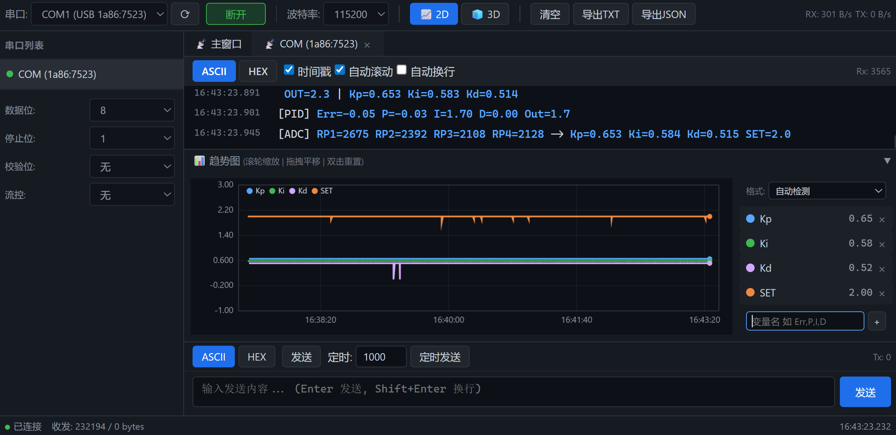
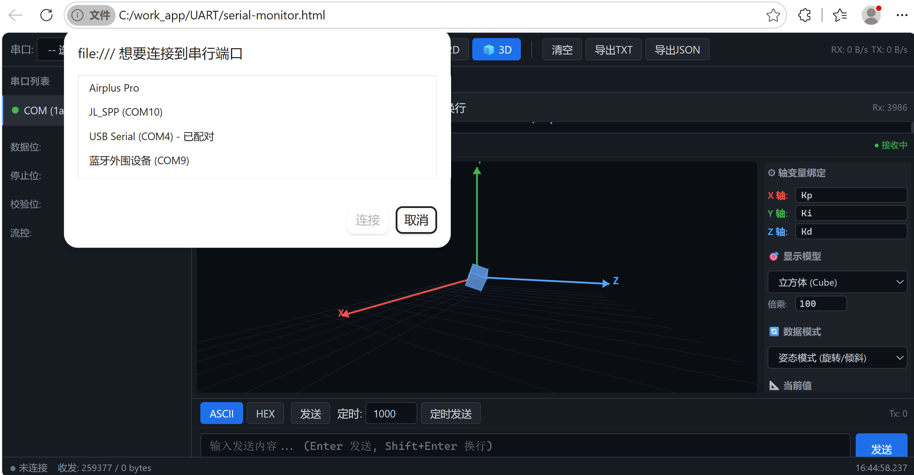
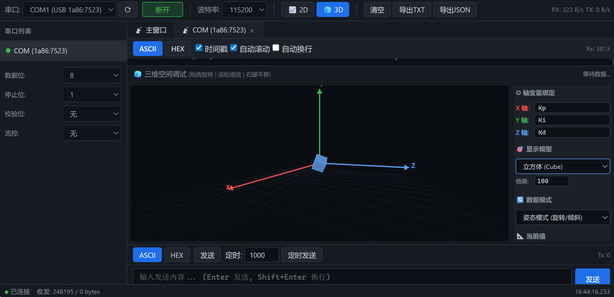

# UART 串口调试助手

纯浏览器端串口调试工具，单文件 HTML，无需安装，双击即用。

支持 **2D 实时趋势图** + **3D 空间可视化**，专为嵌入式开发调试设计。

---

## 环境要求

| 项目 | 说明 |
|------|------|
| 浏览器 | **Chrome** 或 **Edge**（需要 Chromium 内核，支持 Web Serial API） |
| 操作系统 | Windows / macOS / Linux 均可 |
| 额外依赖 | **无**。不需要 Node.js、不需要 npm install、不需要任何 JS 库或 CDN |
| 网络要求 | **不需要**。完全离线可用，下载后双击即可 |

> 拷贝到任何电脑上，双击 `serial-monitor.html` 直接用。

---

## 功能

### 串口通信
- Web Serial API，Chrome / Edge 浏览器原生支持
- 波特率、数据位、停止位、校验位、流控 全参数可配
- 热插拔自动检测，多串口同时连接

### 数据收发
- 接收区 ASCII / HEX 双模式切换，毫秒级时间戳
- 发送区 ASCII / HEX 输入，支持手动发送 + 定时发送 + 发送历史
- 自动滚动 / 暂停 / 自动换行

### 变量解析 & 趋势图
- 自动识别 `key=value`、`key:value`、`{key:value}` 三种格式
- 自定义变量绑定，实时多线折线图（暗黑主题）
- 滚轮缩放、拖拽平移、双击重置

### 三维空间调试
- 2D / 3D 一键切换
- 姿态模式（旋转角度）与位置模式（空间坐标）
- 立方体、电路板、坐标点、轨迹线四种模型
- 变量自由绑定到 X/Y/Z 轴，支持倍乘

### 数据导出
- TXT 日志（含 HEX dump）/ JSON 结构化数据



---

## 快速开始

### 1. 打开
用 Chrome 或 Edge 浏览器打开 `serial-monitor.html`（双击即可）。

> 必须使用 Chromium 内核浏览器，Firefox / Safari 不支持 Web Serial API。

### 2. 连接串口
1. 顶部工具栏选择串口设备
2. 配置波特率等参数（默认 115200-8-N-1）
3. 点击「**连接**」



### 3. 收发数据
- 接收区实时显示数据，支持 ASCII / HEX 切换
- 底部输入框发送数据，按 `Enter` 发送，`Shift+Enter` 换行

### 4. 趋势图
1. 右侧面板输入要追踪的变量名，如 `Err, Out, SET`，点击 `+`
2. 数据中出现匹配变量时自动绘制折线
3. 滚轮缩放、拖拽平移

### 5. 三维空间
1. 点击工具栏 `🧊 3D` 切换到三维视图
2. 绑定变量到 X / Y / Z 轴
3. 选择数据模式（姿态/位置）和模型类型
4. 鼠标拖拽旋转、滚轮缩放



---

## 快捷键

| 快捷键 | 功能 |
|--------|------|
| `Enter` | 发送数据 |
| `Ctrl + Shift + C` | 连接 / 断开 |
| `Ctrl + L` | 清空接收区 |

---

## 技术栈

纯浏览器原生技术，零 npm、零框架、零 CDN：

| 层 | 技术 |
|----|------|
| 结构 | HTML5 |
| 样式 | CSS3 |
| 逻辑 | 原生 JavaScript (ES6+) |
| 图表 | Canvas 2D 自绘 |
| 3D | Canvas 2D 软件渲染 |
| 串口 | Web Serial API |

---

## 文件结构

```
├── serial-monitor.html    # 主程序
├── README.md              # 本文件
├── AI-DEBUG-GUIDE.md      # AI Agent 联合调试指南
└── screenshots/           # 截图
```
